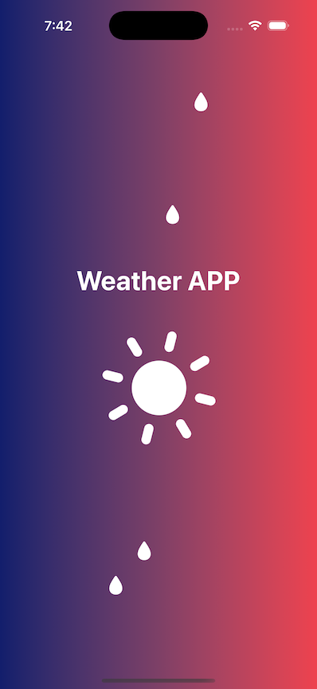
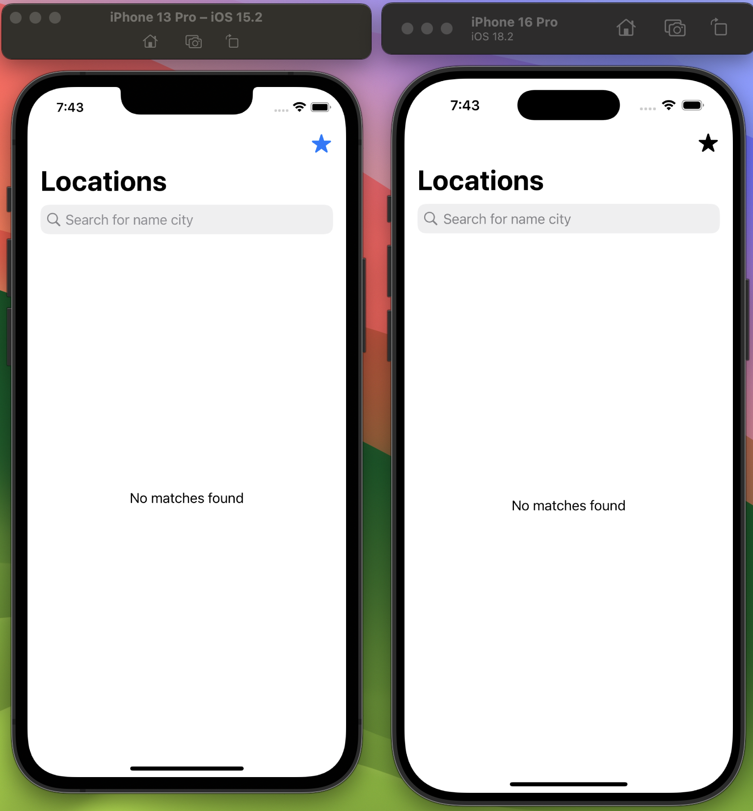
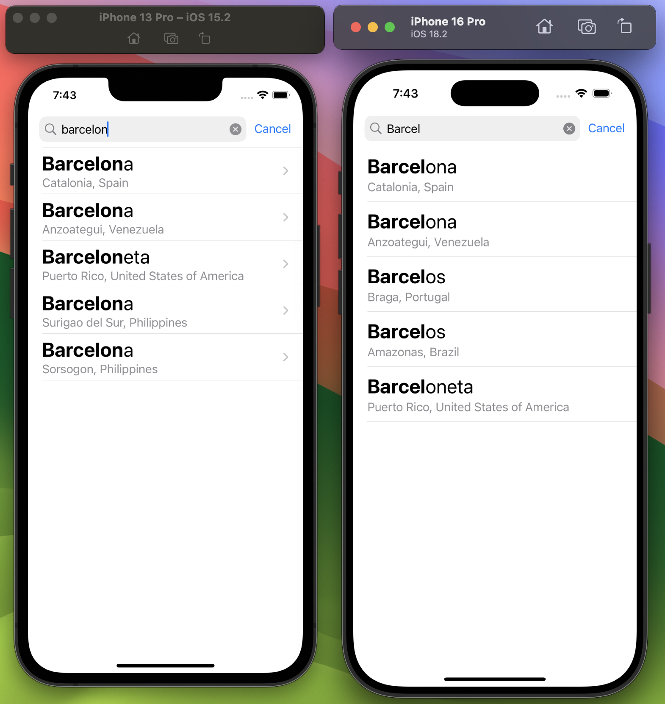
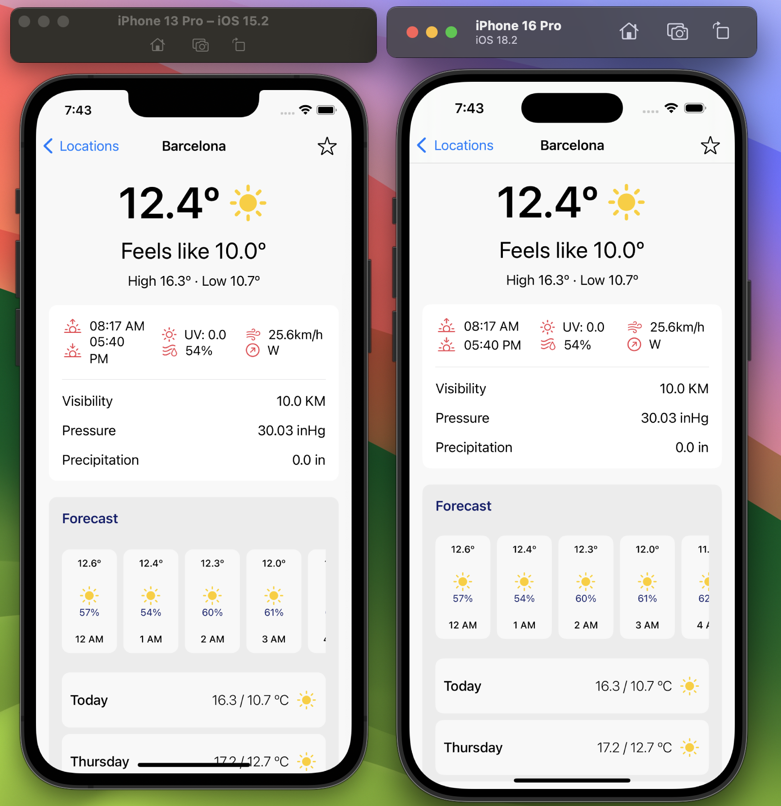
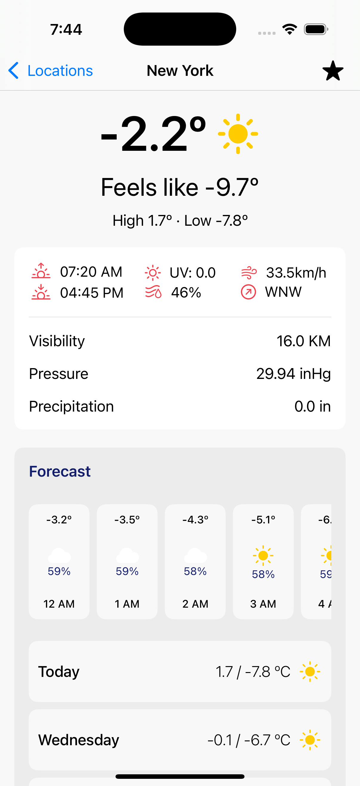
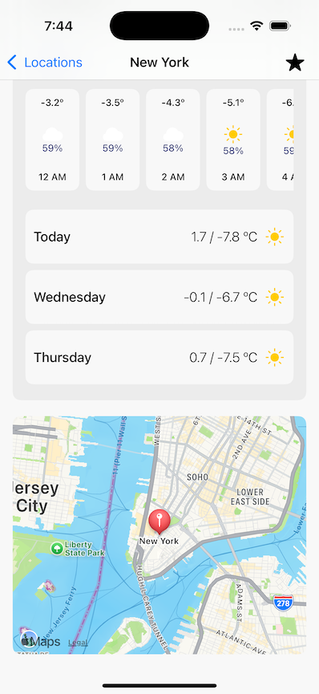
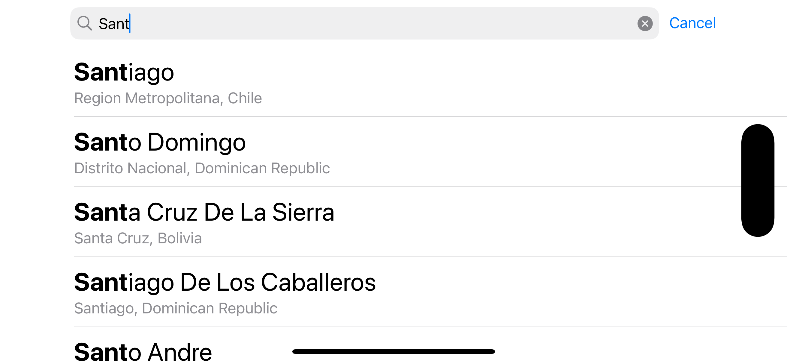
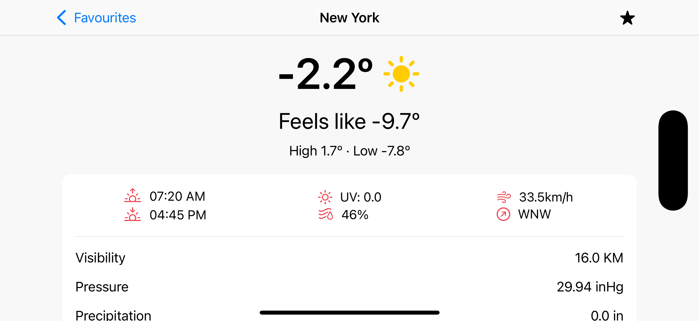

# WeatherApp

Repositorio para prueba técnica

Este proyecto es una aplicación de búsqueda y visualización del clima de alguna ubicación específica. Permite a los usuarios buscar ubicaciones por nombre, ver el detalle de cada una y proporciona una interfaz adaptativa para diferentes orientaciones de pantalla (portrait y landscape).

## Requisitos de sistema y build
- Xcode 16.2 y iOS versión mínima soportada 15.2 (Fue la menor que Xcode permitió)
- Para compilar solo se requiere instalar la dependencia ViewInspector que ya esta agregada mediante Swift Package Manager.

## Características

- **Búsqueda en Tiempo Real:** Busca ubicaciones mediante un campo de texto con filtrado en tiempo real.
- **Lista de Ubicaciones:** Visualización de las ciudades en una lista desplazable, mostrando nombre, país y región, coordenadas y poder marcar como favorita o no.
- **Detalle de ubicación:** Al seleccionar una ubicación, se muestran los datos más relevantes obtenidos también a través de la api, se muestra un mapa y la posibilidad de marcar como favorita o no.
- **Defaults:** Se usó este medio de almacenamiento para guardar las ubicaciones favoritas, me pareció que se adaptaba más a este reto, también se puede hacer con CoreData y solo requiere un pequeño ajuste al DataManager.
- **Arquitectura MVVM:** Separación clara de la lógica de negocio y la vista, facilitando el mantenimiento y la escalabilidad.

## Arquitectura
La aplicación sigue la arquitectura MVVM (Model-View-ViewModel) + Router, aprovechando SwiftUI para la construcción de la interfaz de usuario.

## Estructura del Proyecto
- **Modelos:** Representación de los datos de la ubicación obtenidos de la API y para gestionar los datos almacenados en los defaults
- **Vista:** Componentes de interfaz de usuario construidos con SwiftUI, diseñados para ser reutilizables y adaptativos tanto orientación portrait como landscape.
- **ViewModel:** Maneja la lógica de presentación, interactúa con los modelos, y prepara los datos para la vista.
- **Managers:** Clases responsables de manejar diferentes aspectos de la aplicación, como las solicitudes de red y la gestión de datos locales.

## Tecnologías Utilizadas
- **SwiftUI:** Framework declarativo para la construcción de interfaces de usuario.
- **Combine:** Framework para manejar eventos asincrónicos.
- **ViewInspector:** Framework para realizar pruebas unitarias de vistas de SwiftUI

# Componentes importantes

- **Manejo de Datos:** Se creó un ApiManager para manejar las solicitudes de API y un DataManager para gestionar los datos locales.

- **Reutilización de Vistas:** Las vistas de la lista y el detalle del clima fueron diseñadas para verse adecuadamente en ambas orientaciones, mejorando la eficiencia y la cohesión del código.

- **Optimización de Búsquedas:** Se implementó **debounce** de combine (Esperar 1 segundo hasta que el usuario deje de escribir) para realizar la búsqueda y mejorar el rendimiento y asi evitar solicitudes innecesarias que sobrecarguen el sistema.
 
    Adicional las busquedas recientes se almacenan en **cache** (Diccionario), en tiempo de ejecucion, para no tener que acceder siempre a la api y asi mejorar los tiempos de respuesta y optimización. 

## Pruebas
Se implementaron pruebas unitarias y de interfaz para asegurar la funcionalidad y estabilidad de la aplicación.

- **Pruebas Unitarias:** Se probaron los ViewModels y los Managers para verificar la lógica de negocio.
- **Pruebas de UI:** Usando ViewInspector, se verificaron las vistas y la interacción del usuario.

***

